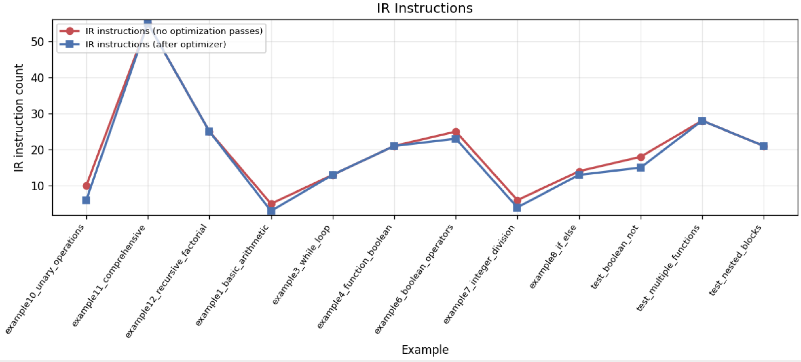

# Python To C Compiler/Transpiler

## Overview
A completely functional compiler implementation from **Python** to **C**. Below is a visualization of the implemented compilation pipeline:


There are ***3*** stages to the compiler:

1. ***Front-end:*** The input source code is tokenized by the **Lexer/Scanner**, and passed to **Parser** to match the token stream on a defined grammar (implemented with **PLY Lex** and **PLY Yacc**, respectively). The **Abstract Syntax Tree (AST)** that is generated is type checked against its specs, and then the **Intermediate Representation (IR)** is generated. This implementation uses **Three Address Code (TAC)** as the IR (aligning with industry standard IRs such as **LLVM IR**).
2. ***Middle-end:*** The IR code is optimized with various techniques and passes to reduce instructions and heavy operations. TAC is highly beneficial here as it makes implmenting optimizations a lot easier.
3. **Back-end:** Finally, the IR code is generated to the target C code.

## Optimizations & Results
The optimization passes operate on the produced IR through a multi-pass pipeline, where each pass transforms the code with the purpose of simplifying or reducing computation. The implemented optimizations are (applied in this exact order):
- **Constant Propagation:** Replaces variables with known constant values
- **Constant Folding:** Evaluates expressions involving constants at compile time
- **Copy Propagation:** Eliminates redundant variable copies by replacing one with another
- **Common Subexpression Elimination:** Reuses previously computed expressions
- **Strength Reduction:** Replaces expensive operations with cheaper ones
- **Dead Code Elimination:** Removes code that does not affect the program output

Below is a graph detailing improvements, on various examples, made by the optimizations:



### Prerequisites
- Python 3
- GCC (for compiling generated C)

### Install dependencies
```bash
pip install ply
```

## Running

### Compiler CLI
```bash
python TheComPylersCompiler.py [--no-optimize] [--emit-ir]
```

- `--no-optimize`: disables optimization passes
- `--emit-ir`: emits intermediate representation output

### Automation runner
The automation script compiles examples, verifies generated C against golden files,
and runs static + GCC checks.

```bash
python run_automation.py
```

Default behavior:
- Uses `examples/lang` and `examples/optimization`
- Uses optimized expected outputs from `examples_expected`

### Common modes
```bash
python run_automation.py                      # optimize mode
python run_automation.py --no-optimize        # no optimization
python run_automation.py --both-modes         # run optimize + no-optimize
```

### Recommended day-to-day command
```bash
python run_automation.py --log
```

This generates per-example verification logs (including invalid examples) and an
overall `Index.txt` summary in the output directory.

### Logging variants
```bash
python run_automation.py --log
python run_automation.py --log path/to/dir
python run_automation.py --log --log-ast
python run_automation.py --both-modes --log
```

- `--log-ast`: includes AST output in logs
- `--both-modes --log`: logs optimized and non-optimized runs

### Useful automation flags
- `--dirs`: example roots (default: `examples/lang examples/optimization`)
- `--output-dir`: generated C output root (default: `output/`)
- `--expected-dir`: golden C root (default: `examples_expected`)
- `--verbose`: prints full generated-vs-expected diff and full generated C on failure

### Golden files
- Optimized reference: `examples_expected/`
- No-opt reference: `examples_expected_noopt/`

Generated C is verified by diffing against these manually-verified expected files.
